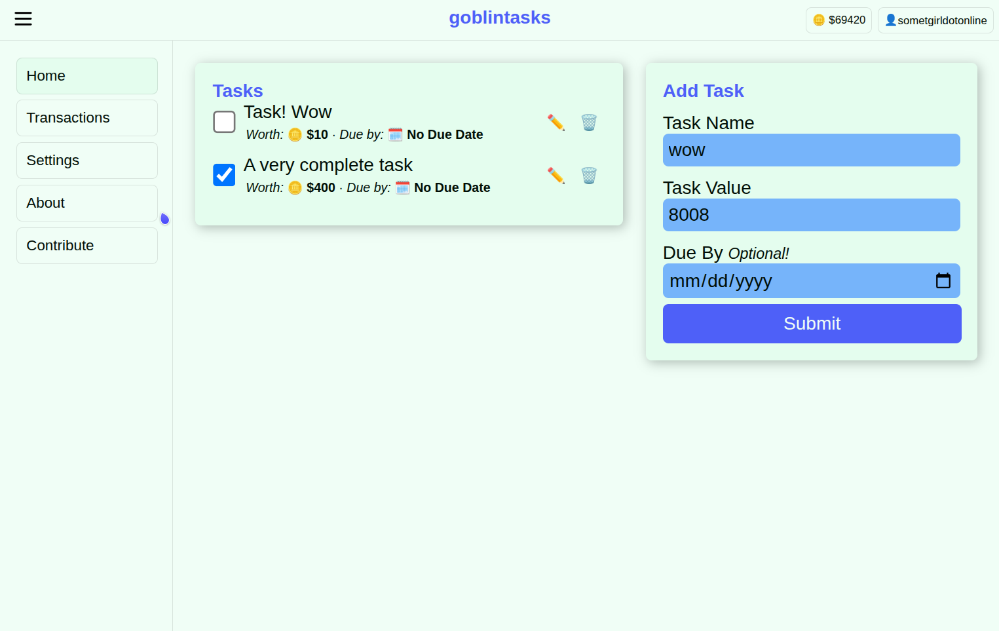

# Goblintasks

Reward based Todos app for ADHDers. Goblintasks blocks distracting sites (specified by you) during "work periods" set by you. (coming soon) To unblock a site (or functionality on it, keep reading), you need to spend an amount of coins (specified by you for each site), you can unblock it in blocks of 5 minutes. You earn coins by checking off tasks (each task has a value specified by you)

## Functionality blocking?
Some websites will have different block methods in Goblintasks. For example, when blocking is active, GoblinTasks hides feeds and notifications in YouTube, but still lets you watch a video (from a link) itself.
The blocking will be handled by a WebExtension built for chromium and firefox (coming sometime), and eventually an android app.

## On the topic of iOS + Safari Support

I unfortunately cannot easily support apple platforms, as to officially publish an app on the iOS Store or Safari Store, it requires the developer to pay $100USD a year, which is quite frankly unsustainable when compared to Play Stores $25USD single time fee or Chrome Extension Store's $5 USD one time fee.

Not to mention, to develop for iOS I need a Mac and iPhone, neither of which I own (i know about VM's shut up, macOS in a VM is not fun)

Please, just use a free-er platform

(A suggestion to safari users; Switch to Orion browser, it's basically Safari on steroids, and it supports Chrome and Firefox extensions ;) )

Magic Theme Colour Pallete: https://lospec.com/palette-list/teaviie
